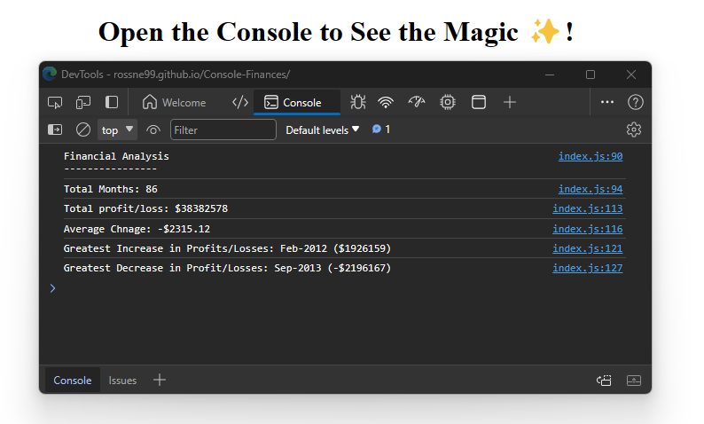

# Console-Finances 📈💵

## Description
This repository contains the code for my Console Finances web app. The goal of this project revolves around handling a pre-existing dataset and performing essential calculations, with the results neatly displayed in the console.

This web app calculates the following from a given dataset;
- The total number of months included in the dataset.
- The net total amount of Profit/Losses over the entire period.
- The average of the changes in Profit/Losses over the entire period.
- The greatest increase in Profit/Losses (date and difference in the amounts) over the entire period.
- The greatest decrease in Profit/Losses (date and difference in the amounts) over the entire period.

The driving force behind this endeavor was to simulate a real-world scenario, fostering a comprehensive understanding not only of the code structure but also of the intricate calculations involved. Despite the dataset being available in its raw format, manually crunching these numbers would have been tedious and error-prone. To overcome this challenge, I've developed a JavaScript application that automates the iteration through the dataset array, executing diverse calculations and showcasing the results in the console. This streamlined approach not only saves time but also ensures a more accurate and reliable solution, making it an ideal tool for financial analysis tasks. Feel free to explore and leverage this repository for your own financial data analysis projects.

## Table of Contents

- [Dev Requirements](#Dev-Requirements)
- [Dev Environment Setup](#Dev-Environment-Setup)
- [Enduser usage instructions](#End-user-usage-instructions)
- [Features](#Features)
- [How to contribute](#How-to-contribute)
- [technologies ](#technologies)
- [Screenshot](#Screenshot)
- [Credits](#credits)
- [License](#license)

## Dev Requirements
Git/GitBash, VS Code, and the source code, of course! 🛠️

## Dev Environment Setup
To get the development environment running:
1. Clone this repo
2. Open the repo folder in VS Code
3. Right-click on `index.html` and open it using the default browser.

- `index.html`: Contains all HTML code for the webpage
- `assets/index.js`: Contains all javaScript code for the webapp
- `assets/images/`: Contains all images used in the webpage

## Enduser usage instructions
There is no special requirements for end users. Simply visit [here](https://rossne99.github.io/Console-Finances/) to view the webpage, then press F12 to open the console.

## Features
- **Shows Total months incdluded in data set**
- **Shows Total profit & Loss in data set**
- **Shows average change in P&l**
- **Shows gratest increase and decrease in profit and loss**

## How to contribute
1. Fork this repository
2. Clone the repository
3. Create a branch for your bug fix or feature
4. Make necessary changes and commit those changes
5. Push changes to GitHub
6. Create a pull request to this repo to submit your changes for review

## Technologies
- **JavaScript**
- **HTML**

## Screenshot

The following image shows the web application's appearance and functionality:

> **Note**: This applcation only runs in the console.

## Credits 
- **Ross** - Source Code

---

## Licence

MIT License

Copyright (c) 2023 RossNE99

Permission is hereby granted, free of charge, to any person obtaining a copy
of this software and associated documentation files (the "Software"), to deal
in the Software without restriction, including without limitation the rights
to use, copy, modify, merge, publish, distribute, sublicense, and/or sell
copies of the Software, and to permit persons to whom the Software is
furnished to do so, subject to the following conditions:

The above copyright notice and this permission notice shall be included in all
copies or substantial portions of the Software.

THE SOFTWARE IS PROVIDED "AS IS", WITHOUT WARRANTY OF ANY KIND, EXPRESS OR
IMPLIED, INCLUDING BUT NOT LIMITED TO THE WARRANTIES OF MERCHANTABILITY,
FITNESS FOR A PARTICULAR PURPOSE AND NONINFRINGEMENT. IN NO EVENT SHALL THE
AUTHORS OR COPYRIGHT HOLDERS BE LIABLE FOR ANY CLAIM, DAMAGES OR OTHER
LIABILITY, WHETHER IN AN ACTION OF CONTRACT, TORT OR OTHERWISE, ARISING FROM,
OUT OF OR IN CONNECTION WITH THE SOFTWARE OR THE USE OR OTHER DEALINGS IN THE
SOFTWARE.
